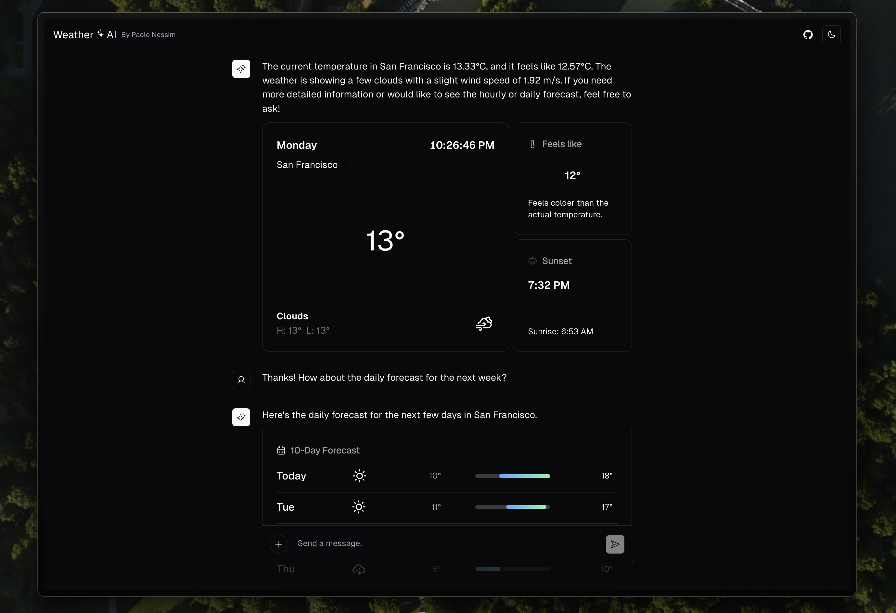

  <h1 align="center">Weather AI</h1>



<p align="center" style="padding: 20px 0 ;">
Weather AI is weather chatbot that uses generative UI to provide a conversational interface for weather information.
</p>

<p align="center" style="margin-bottom: -20px">
  <a href=""><strong>Demo Video</strong></a> ·
  <a href="#features"><strong>Features</strong></a> ·
  <a href="#running-locally"><strong>Running locally</strong></a>.
  <a href="#acknowledgments"><strong>Acknowledgments</strong></a>
</p>
<br/>

## Features

- [Next.js](https://nextjs.org) App Router
- React Server Components (RSCs), Suspense, and Server Actions
- [Vercel AI SDK](https://sdk.vercel.ai/docs) for streaming chat UI
- Support for OpenAI (default), Anthropic, Cohere, Hugging Face, or custom AI chat models and/or LangChain
- [shadcn/ui](https://ui.shadcn.com)
  - Styling with [Tailwind CSS](https://tailwindcss.com)
  - [Radix UI](https://radix-ui.com) for headless component primitives
  - Icons from [Phosphor Icons](https://phosphoricons.com)

## Running locally

You will need to use the environment variables [defined in `.env.example`](.env.example)

> Note: You should not commit your `.env` file or it will expose secrets that will allow others to control access to your various OpenAI and authentication provider accounts.

```bash
pnpm install
pnpm dev
```

Your app template should now be running on [localhost:3000](http://localhost:3000/).

## Acknowledgments

This woun't be possible without the following resources:

- [Vercel AI SDK](https://sdk.vercel.ai/docs)
- [Shadcn UI](https://ui.shadcn.com)
- [Ollama](https://ollama.com)
